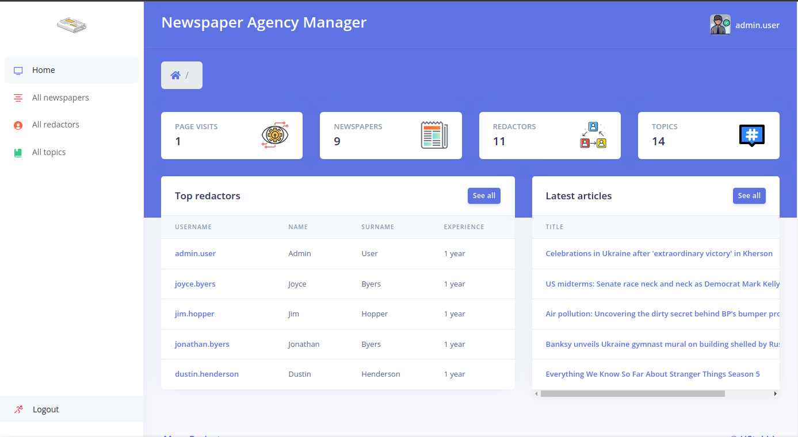

# Newspaper Agency Manager

Django project for tracking Redactors, assigned to Newspapers.
You will always know, who were the publishers of each Newspaper.

## Check it out!

[Newspaper Agency project deployed to Render](https://newspaper-agency-al6o.onrender.com)

```
Log in as

Staff user
username: staff.user
password: 5hBVut4B

Ordinary user
username: just.user
password: 5hBVut4B
```

## Installation

Python3 must be already installed

```shell
git clone https://github.com/HStakhiv/newspaper-agency.git
cd newspaper-agency
python3 -n venv venv
source venv/bin/activate
pip install -r requirments.txt
python manage.py makemigrations
python manage.py migrate
python manage.py loaddata newspaper_agency_db_data.json
python manage.py runserver
```

## Features

* Authentication functional for Redactor/User
* Managing newspapers, redactors and topics, directly from website interface
* Powerful admin panel for advanced managing

## Demo


